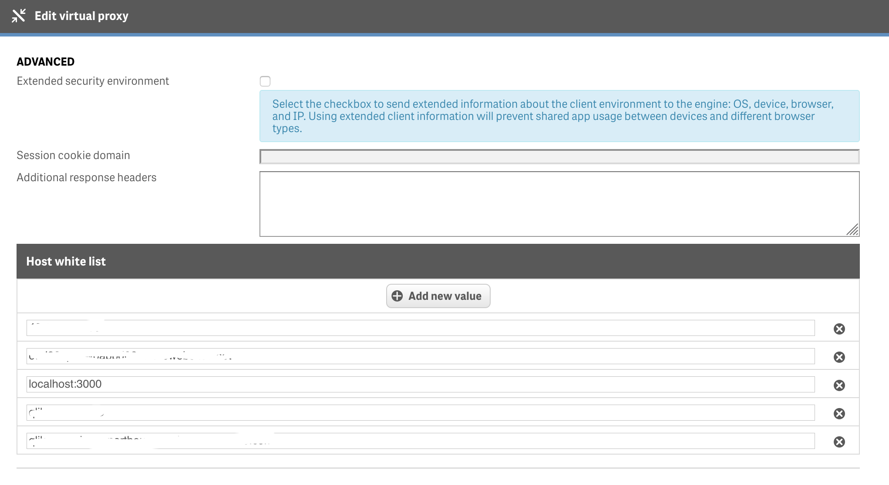

# **Reaqtive**

Reaqtive is a react library to help creating guided analytics for Qlik Sense, it allows you to easily interact with Qlik's Engine and Capability APIs.
The goal of the library is to provide a framework to develop guided analytics applications on top of Qlik Sense/QAP apps.
Apps developed with Reaqtive are inteded improve experience of those users who do not need self service BI functionalities, but only need to navigate predefined visualizations.
Reaqtive aims to bring together the responsiveness and usability on mobile devices provided by Qlik Sense with the navigation functionalities provided by QlikView.
All the examples are made using the ```Executive Dasboard.qvf``` which included in this repository.
If you already tried Reaqtive and you are having troubles with Reaqtive check the [FAQ](#faq) section or raise an issue.


## Thanks to

Reaqtive is sponsored by [Engineering Ingegneria Informatica](https://www.eng.it/).


## Usage
Everything is opt-in: Reaqtive provides a set of tools and developers can pick only what they need.
There 4 ways to use Reaqtive:
1. The most basic usage would be to wrap your React app or component with a Reaqtive tag: Reaqtive will provide the connections to the Qlik APIs and it will be up to you to get data and visualizations.
2. You can use hooks and components included in [@reaqtive/q](https://github.com/xuuajii/reaqtive/tree/master/packages/q), which are ready to use interfaces to interact with the QIX Engine
3. You can add layout components and visualizations provided by [@reaqtive/components](https://github.com/xuuajii/reaqtive/tree/master/packages/components)
4. You can add routing and navigation using [RqtvApp](https://github.com/xuuajii/reaqtive/tree/master/packages/components#app)


## Before starting
To use Reaqtive in your app you need to have [node.js](https://nodejs.org/) already installed on your machine and it is recommended to install [git](https://git-scm.com/downloads).
You should be familiar with React, npm, Bootstrap and the javascript ecosystem in general.
If you are not you can find useful info and tutorials at the [bottom of the page](#useful-resources).

## Installation

```
npm install @reaqtive/components
```

## First Reaqtive App

Below you can find the code to create the simplest Reaqtive app. It is assumed that you have alredy created a [React app](https://create-react-app.dev/) and, if you are using CRA, that you have created the [setupProxy file](#how-to-use-reaqtive-with-create-react-app).
The app shows a dropdown menu to be used as a filter and one visualization provided by Qlik Capability APIs.
The Reaqtive component handles the connection with the Qlik Sense server and it expects connections parameters to be provided in an object called qConfig.
Notice that at the top of the page Reaqtive scss file has been imported (for [details](https://github.com/xuuajii/reaqtive/tree/master/packages/components#styles)).


```javascript
import React from 'react'
import Reaqtive  from '@reaqtive/q'
import {RqtvDropdownFilter, QViz, RqtvVizContainer} from '@reaqtive/components'

import "@reaqtive/components/dist/index.scss";

const qConfig = {                                 //For QS Desktop
    host: 'YOUR HOST ADDRESS',                        //localhost
    secure: true,                                 //false
    port: 443,                                    //4848
    prefix: '',                                   //''
    appId: '8aa3a035-0689-4aab-a920-d6722509ed51' //your app file name (e.g. 'Executive dashboard.qvf')
};

const FirstApp = props =>
<div className='container'>
  <Reaqtive
    qConfig={qConfig}
  >
    <RqtvDropdownFilter
      qFieldExpr="Customer"
      dropdownMenuItemStyle={{textTransform:'uppercase'}}
    />
    <QViz
      id="Revenue By Product Group"
      title="Revenue By Product Group"
      chartProps={{
        chartType:'barchart',
        rest: {
          qHyperCubeDef:{
            qDimensions:[{
              "qDef":{
                "qFieldDefs": ["[Product Group Desc]"],
                 "qFieldLabels": ["Product Group Desc"],
                 //"qSortCriterias":[{qSort:1}],
                 "qReverseSort":true
               }
             }],
            qMeasures:[{
              "qDef":{
                "qDef":"Sum([Sales Quantity]*[Sales Price])",
                "qLabel":"Revenue"
              }
            }]
          },
          "showTitles": false,
          "title": "Revenue",
          "barGrouping":{grouping:"stacked"},
          "orientation":'horizontal'
        }
      }}
      height={500}
    />
  </Reaqtive>
</div>
export default FirstApp

```


If you want to use Reaqtive components and utilities follow the links below.

- Create your analytics web app with [@reaqtive/components](https://github.com/xuuajii/reaqtive/tree/master/packages/components)
- Connect your React app to Qlik with [@reaqtive/q](https://github.com/xuuajii/reaqtive/tree/master/packages/q)

### qConfig

It is the object used to provide Reaqtive the parameters to connect to Qlik APIs. It has to be passed as a prop to the Reaqtive component that will handle the connection.
If you need to handle multiple environments you will need one qConfig object per environmet. You can save them in a file and use them as needed.
Below an example of one file with 2 environments:

```javascript

const qEnvironments = {
  "DESKTOP": {
    host: 'localhost',
    secure: false,
    port: 4848,
    prefix: '',
    appId: 'Executive Dashboard.qvf'
  }
  "SERVER":{
    host: 'MY_QLIK_SERVER_HOST',
    secure: true,
    port: 443,
    prefix: 'MY_QLIK_SERVER_PREFIX',
    appId: 'MY_QLIK_APP_ID'
  }
}

const qConfig = qEnvironments['DESKTOP'];//or qEnvironments['SERVER']

module.exports = module.exports = qConfig.default || qConfig;
```

## How to use Reaqtive with create react app

To use Reaqtive with create-react-app you have to configure a proxy for the webpack development server in order to avoid CORS issues.
To do that you have to ```npm install http-proxy-middleware```, create a file called setupProxy.js in the src folder of your app and paste the following lines of code in it (notice that the qConfig object is imported from an external file). For further info follow this [link](https://create-react-app.dev/docs/proxying-api-requests-in-development).
This is needed whether you want to connect to Qlik Sense Desktop or a remote Qlik Server.


```javascript
/**
 * This code configure a proxy to solve CORS issues while developing on your local machine and connecting to Qlik APIs.
 * It must be placed in 'src/setupProxy.js'
 */

const { createProxyMiddleware } = require('http-proxy-middleware');
const qConfig = require('./q-config');

const protocol = `http${((qConfig.secure === true) ? 's' : '')}`;
const host = qConfig.host;
const port = qConfig.port;

console.log('***************************************************************');
console.log('Reaqtive will use this URL to connect to Qlik:', protocol+'://'+host+':'+port);
console.log('***************************************************************');

module.exports = app => {
  app.use(['*/resources/*','*/extension/*','*/extensions/*','*/Exports/*','/api/*','*/sockjs-node/*'],
  createProxyMiddleware({
          target: `${protocol}://${host}:${port}`,//'http://localhost:4848',//
          ws: true,
          wss: true,
          changeOrigin: true,
          secure: false,
          onProxyRes: function onProxyRes(proxyRes, req, res) {
                  proxyRes.headers['Access-Control-Allow-Origin'] = '*';
                  proxyRes.headers['Access-Control-Allow-Credentials']= true;    // add new header to response
        }
    })
  );
};

```


[Here](#https://create-react-app.dev/docs/using-https-in-development) you can find more info about using a proxy with CRA.

## Development using a remote Qlik Server

Before being able to connect to Qlik APIs from a remote server you have to enable your development server in the qmc.
1. Click on the Virtual Proxy label of the qmc
2. Double click on the virual proxy you want to connect to.
3. Open the Advanced menu on the right and add localhost:3000 (or your development server address) to the Host white list (see the image below)
4. Click apply (the virtual proxy will restart and if you are logged in on the same VP you will be kicked out)



Once you have enabled your development server you need to start it in secure mode. To do that launch the server with the following command:
```
HTTPS="true" npm start
```


## Deploy your app to Qlik Sense Enterprise

1. in the root folder of your project (the parent of the src folder) create a file called exactly ```.env.production``` and add this line: ```PUBLIC_URL = /extensions/your-app-name```
2. Open a command line tool in your root folder and run the command ```npm run build``` this will create a build folder which will contain all the files to be deployed
3. Create a qExt file as explained [here](https://help.qlik.com/en-US/sense-developer/June2019/Subsystems/Mashups/Content/Sense_Mashups/mashups-getting-started.htm) and place it in the build folder. The name property in this file must match the app name you enterd in .env.production
4. zip the content of the build folder (not the folder itself: when opening the zip file you must see the content of the build folder not the build folder)
5. upload the zip as an extension using the QMC and navigate to ```https://your.qlik.server/extensions/your-rqtv-app-name/index.html```


## Useful resources

Below you can find the links to the official sites of the technologies used to develop Reaqtive.

- [React](https://reactjs.org/)
- [Sass](https://sass-lang.com/)
- [Bootstrap](https://getbootstrap.com/)
- [npm](https://www.npmjs.com/)
- [React Router](https://reacttraining.com/react-router/web/guides/quick-start)
- [Create React App](https://create-react-app.dev/)
- [React Spring](https://www.react-spring.io/)
- [node.js](https://nodejs.org)

Below a list of links to tutorials you can watch to get started with the technologies mentioned above:

- [React tutorial](https://www.youtube.com/watch?v=6RhOzQciVwI&list=PL4cUxeGkcC9hNokByJilPg5g9m2APUePI)
- [Bootstrap tutorial](https://www.youtube.com/watch?v=QAgrHLtG1Yk&list=PL4cUxeGkcC9jE_cGvLLC60C_PeF_24pvv)
- [Sass tutorial](https://www.youtube.com/watch?v=St5B7hnMLjg&list=PL4cUxeGkcC9iEwigam3gTjU_7IA3W2WZA)
- [npm tutorial](https://www.youtube.com/watch?v=kQ1j0rEI7EI&list=PL4cUxeGkcC9gcy9lrvMJ75z9maRw4byYp&index=20)

## FAQ

__Q__:Is it possible to connect to more than one Qlik App?

__A__: Yes, if you want to use only the engine APIs remember to set to false the qCapabilityApiRequired of the Reaqtive components. If you need to use also the capablity APIs you must use the [QShareCapabilityApi](https://github.com/taan11/reaqtive/blob/master/packages/q/src/lib/components/q-share-capability-api.js) component
##

__Q__: While developing I can't connect to Qlik APIs because of CORS issues

__A__: Remeber to create the setupProxy file as explained [here](#how-to-use-reaqtive-with-create-react-app)
##

__Q__: While developing I can't connect to Qlik remote server

__A__: Be sure to have an active session with Qlik Sense in the same browser and to start the development server in secure mode (HTTPS="true"). Check [this section](#how-to-use-reaqtive-with-create-react-app)
##

__Q__: How can I deploy my mash up to Qlik Sense Enterprise?

__A__: Check [this section](#deploy-your-app-to-qlik-sense-enterprise)
##

__Q__: When I navigate to a page with condition using query string, I am always redirected to the fallback page

__A__: Add a key property to your RqtvPages. This will force them to unmount when changing the url in your address bar
##

__Q__: I can use the Engine API, but I can't see the objects provided by the Capability APIs

__A__: You are likely to have started your React app in non secure mode: add HTTPS="true" before npm start.
##
